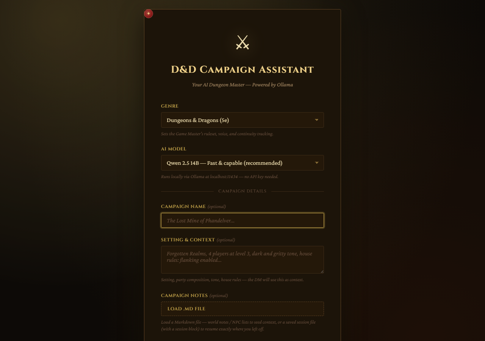
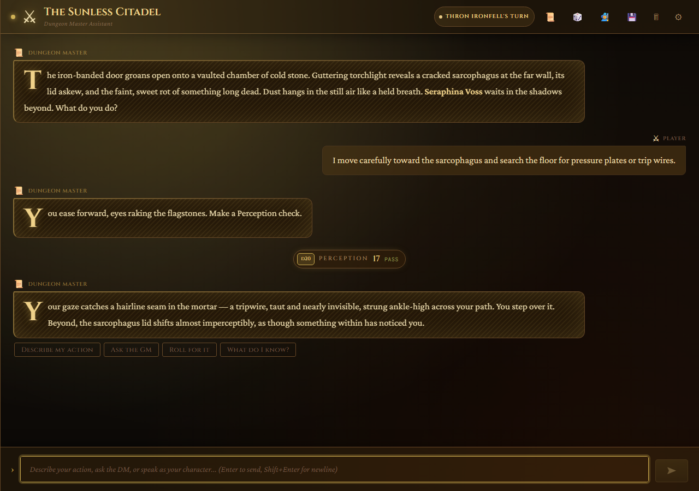
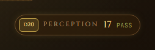
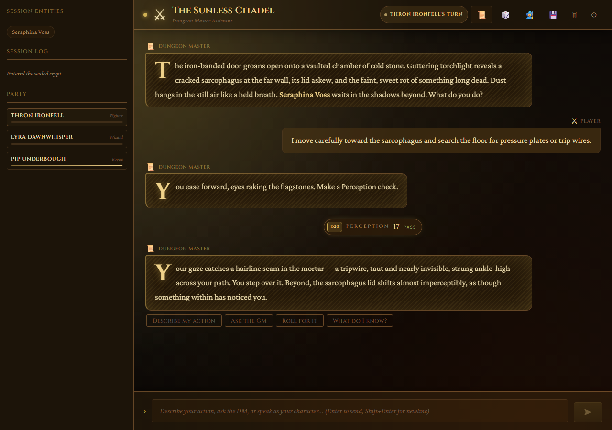
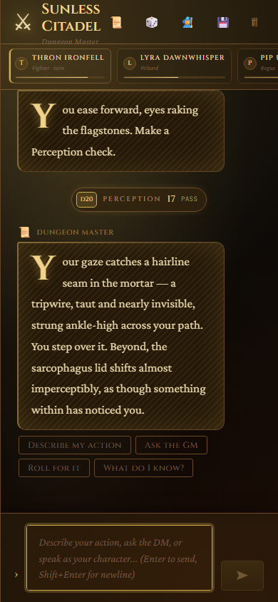
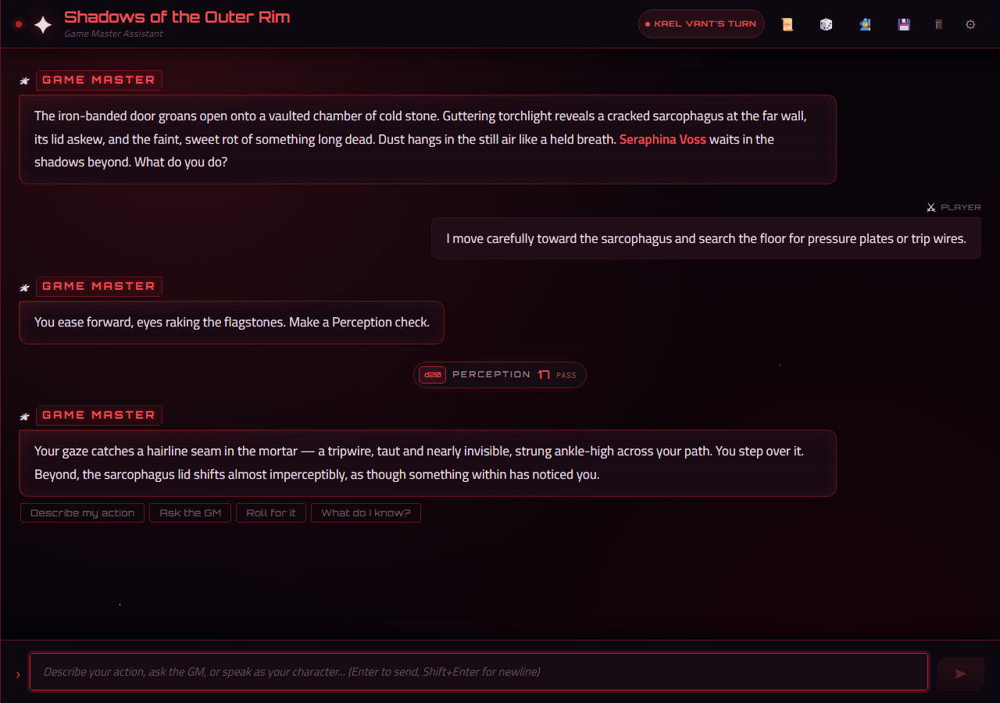

# Daniel and Dragons

A local-first AI Dungeon Master (and Star Wars Game Master) powered by a locally running **Ollama** instance. Nothing is sent to the cloud, and no API key is required.

The project is named after my friend Dan, a longtime Dungeon Master. He's always the one running the game for everyone else, so I built this to let the AI handle the DM seat and give Dan a turn as a player.



---

## Features

- **Two genre-driven themes** — Dungeons & Dragons 5e ("Candle-lit Grimoire" dark theme) and Star Wars Saga Edition ("Crimson Void" dark theme). Genre selection drives both the visual theme and the system prompt engine; there is no independent theme toggle.
- **Streaming Ollama chat** — messages stream token-by-token from `http://localhost:11434/api/chat`. Default model: `qwen2.5:14b`.
- **LLM-managed party HUD** — the AI DM appends fenced ` ```party ` JSON blocks to each response; the app parses them and renders the live party roster in the header turn-pill (desktop), the mobile PartyStrip, and the Campaign History panel.
- **Dice roller + skill-check verdicts** — roll d4 through d100 in-chat. The DM emits ` ```check ` (skill + DC) and ` ```verdict ` (PASS/FAIL) structured blocks; these upgrade bare dice messages into resolved DiceChip components.
- **Session persistence (localStorage)** — the full session (messages, party, campaign) is saved to `localStorage` on every settled turn with a `QuotaExceededError` trim-and-retry.
- **Markdown save/continue** — download a self-contained, LLM-loadable `.md` handoff from the header button; load it on any device via the setup screen's "Load .md file" button to resume the session.
- **Real-time multiplayer** — the sync server now hosts a WebSocket endpoint (`ws://<host>:3001/ws`) in addition to the existing REST API on the same port. Players join a shared room via `?room=dnd-<8hex>` in the URL. The server owns the DM seat: it proxies Ollama server-side (one trigger per room per turn), broadcasts `dm:delta`/`dm:done`/`session:update`/`presence:update` events to all clients, and enforces combat turn order. With no `?room=` in the URL, no WebSocket is opened and single-player behaves exactly as before.
- **LAN cross-device sync (single-player fallback)** — an Express sync server (`server/sync-server.mjs`) stores sessions as `.md` files and serves them over your local network. The app auto-derives the desktop host from `window.location.hostname`, so opening `http://<desktop-IP>:5173` on a phone targets the desktop's Ollama and sync server automatically. The 30-second HTTP poll is suspended while a WebSocket connection is open and resumes automatically on disconnect.

---

## Screenshots

| D&D play screen | Resolved dice chip |
|---|---|
|  |  |

| Campaign History panel (desktop) | Mobile party strip |
|---|---|
|  |  |

**Star Wars "Crimson Void" theme**



---

## Prerequisites

| Requirement | Notes |
|---|---|
| **Node.js** | v18 or later recommended |
| **Ollama** | Running locally at `http://localhost:11434`. Download: [Windows installer](https://ollama.com/download/OllamaSetup.exe) · [all platforms](https://ollama.com/download) |
| **Model** | `qwen2.5:14b` pulled in Ollama (`ollama pull qwen2.5:14b`) |

Ports used:

| Port | Service |
|---|---|
| `5173` | Vite dev server |
| `3001` | LAN sync server |
| `11434` | Ollama |

---

## Quick Start

**1. Clone and install.**

```powershell
git clone https://github.com/EricChan277/dnd-claude.git
cd dnd-claude
npm install
```

**2. Start Ollama and confirm the model is ready.**

```powershell
ollama pull qwen2.5:14b   # skip if already pulled
ollama serve              # runs at http://localhost:11434
```

Ollama must be running before you start a session — `Chat.jsx` POSTs to `http://<host>:11434/api/chat` with `stream: true`.

**3. Start the dev server (Vite on 5173 + sync server on 3001).**

```powershell
npm run dev
```

**4. Open `http://localhost:5173`** and fill in the setup screen:

| Field | Required | Notes |
|---|---|---|
| **Genre** | Yes | `Dungeons & Dragons (5e)` or `Star Wars (d20 / Saga Edition)`. Drives the visual theme **and** the system-prompt engine — there is no separate theme toggle. |
| **AI Model** | Yes | Default `qwen2.5:14b`; `qwen2.5:32b` also available (slower, longer narration). |
| **Campaign Name** | Optional | Used in save-file names and the session header. |
| **Setting & Context** | Optional | Free-text setting, party, tone, house rules — injected into the system prompt. |
| **Campaign Notes / Load .md file** | Optional | Accepts `.md` or `.txt`. A file with a ` ```session ` block boots straight into a saved session (`fromMarkdown`); otherwise its prose loads as `campaign.context`. |

**5. Click "Begin the Campaign"** and type your first action. The AI DM streams its response token-by-token.

---

## Available Scripts

All scripts are defined in `package.json`.

| Script | Command | Description |
|---|---|---|
| `dev` | `concurrently -n vite,sync -c cyan,magenta "vite" "node server/sync-server.mjs"` | Vite + sync server together (recommended) |
| `dev:vite` | `vite` | Vite only — no sync server |
| `sync` | `node server/sync-server.mjs` | Sync server only |
| `build` | `vite build` | Production build |
| `preview` | `vite preview` | Preview the production build locally |
| `test` | `vitest run` | Run the full test suite once (405 passed \| 2 skipped, 407 total — jsdom + Node) |
| `test:watch` | `vitest` | Run tests in watch mode |

---

## Cross-Device / LAN Play

To reach the app and Ollama from a phone (or any device) on the same LAN:

1. Serve Ollama on all interfaces before starting it:

   ```powershell
   $env:OLLAMA_HOST = "0.0.0.0"
   ollama serve
   ```

   The sync server also reads `OLLAMA_HOST` when running a multiplayer room — it proxies Ollama server-side using the same variable, so no separate server-side config is needed.

2. Allow ports **5173**, **3001**, and **11434** through the Windows Firewall.

3. Run `npm run dev` on the desktop.

4. Open `http://<desktop-IP>:5173` on the phone. The app derives the Ollama and sync server host from `window.location.hostname` automatically — no config needed on the phone.

**Joining a multiplayer room.** The host creates a session normally and shares their room code (`dnd-<8hex>`, shown in the session header). Other players open:

```
http://<desktop-IP>:5173?room=dnd-<8hex>
```

The `?room=` query param is read by `App.jsx` on mount and routes the player through the join form instead of the new-campaign setup screen.

**WebSocket origin allowlist.** The sync server accepts WS upgrades only from origins listed in `WS_ALLOWED_ORIGINS` (comma-separated). The default is `http://localhost:5173`. On LAN or Tailscale, set this before starting the server:

```powershell
$env:WS_ALLOWED_ORIGINS = "http://192.168.1.10:5173"
npm run dev
```

Empty/absent `Origin` headers (non-browser clients, test harness) are always allowed.

---

## Play Over the Internet

The app is built for LAN play. Every network host is derived client-side from `window.location.hostname` via `getLanHost()` in `src/lib/session.js`. Whatever hostname the browser used to reach the Vite page is reused for the Ollama API (`http://<hostname>:11434`) and the sync server (`http://<hostname>:3001`). No code changes are needed; a remote device just needs to reach the desktop on those three ports.

Two approaches follow. Tailscale is recommended.

### Option A: Tailscale (recommended)

Tailscale creates an encrypted peer-to-peer mesh (a "tailnet") between your devices. The remote player opens the app using the desktop's Tailscale IP or MagicDNS name; `getLanHost()` picks that up and routes all three ports through the tailnet. No router configuration, no public exposure.

**On the desktop (DM machine)**

1. Install Tailscale and sign in: https://tailscale.com/download

2. Find the desktop's tailnet address. Either form works in the browser:

   ```powershell
   tailscale ip -4          # e.g. 100.x.y.z
   # or use the MagicDNS name shown in the Tailscale admin console
   # e.g.  my-desktop.tail12345.ts.net
   ```

3. Allow Ollama to accept connections from the tailnet interface:

   ```powershell
   $env:OLLAMA_HOST = "0.0.0.0"
   ollama serve
   ```

4. In a second terminal, start the app (Vite + sync server together). If you are using multiplayer, also set the WebSocket origin allowlist to the Tailscale address players will open in their browsers:

   ```powershell
   $env:WS_ALLOWED_ORIGINS = "http://<tailscale-ip>:5173"
   npm run dev
   ```

   Vite binds `0.0.0.0` (`server.host: true` in `vite.config.js`). The sync server also binds `0.0.0.0` (`server/sync-server.mjs`).

**On the remote device (player machine)**

5. Install Tailscale and sign in to **the same tailnet** (same Tailscale account, or an account invited to the tailnet).

6. Open the app in a browser:

   ```
   http://<tailscale-ip>:5173
   # or
   http://<magicdns-name>:5173
   ```

   Because the page was opened via the desktop's Tailscale address, `window.location.hostname` resolves to that same address, and `getLanHost()` routes Ollama calls to `:11434` and sync calls to `:3001` through the tailnet. Identical to LAN behaviour, no code changes. Traffic stays inside the encrypted tunnel and is not exposed to the public internet.

### Option B: Port forwarding (advanced)

Port forwarding opens holes in your router so the remote player connects directly to the desktop over the public internet.

> **Security warning. Read before proceeding.**
>
> This option exposes three unauthenticated services to the open internet over plain HTTP (no TLS):
>
> - **Ollama on :11434** — no authentication. Anyone who reaches this port can run inference on your GPU and enumerate models.
> - **Sync server on :3001** — no authentication. The `PUT /session/:id` and `DELETE /session/:id` REST endpoints let anyone read, overwrite, or delete your campaign sessions. The WebSocket endpoint at `ws://<host>:3001/ws` is also exposed; by default it only accepts connections from `http://localhost:5173`, but set `WS_ALLOWED_ORIGINS` to your public IP's Vite origin to allow remote players. There is no rate limiting beyond the per-connection 500ms action interval.
>
> Use Tailscale (Option A) instead unless you fully understand and accept these risks.

**Why all three ports must be forwarded.** Because `getLanHost()` derives all hosts from `window.location.hostname`, the remote player's browser makes Ollama and sync requests back to the same IP it used to open the page. Forwarding only port 5173 will not work: the browser then hits your public IP on :11434 and :3001 with no route through. All three ports must point to the same desktop machine.

1. In your router admin panel, create three port-forwarding rules, all pointing to the desktop's local IP:

   | External port | Internal port | Protocol |
   |---|---|---|
   | 5173 | 5173 | TCP |
   | 3001 | 3001 | TCP |
   | 11434 | 11434 | TCP |

2. Allow Ollama to bind all interfaces and accept cross-origin requests from the Vite page (`:5173` and `:11434` are different origins, so Ollama's CORS policy applies):

   ```powershell
   $env:OLLAMA_HOST    = "0.0.0.0"
   $env:OLLAMA_ORIGINS = "*"
   ollama serve
   ```

   The sync server already uses `cors({ origin: true })`, so no extra variable is needed there.

3. Start the app with `npm run dev`, find your public IP (e.g. https://ifconfig.me), and have the remote player open `http://<public-ip>:5173`.

### Internet-play troubleshooting

| Symptom | Likely cause | Fix |
|---|---|---|
| Page loads but the AI never responds | Ollama still bound to `localhost`, or port 11434 unreachable | Set `$env:OLLAMA_HOST = "0.0.0.0"` and restart `ollama serve`; for port forwarding, verify the 11434 rule and firewall |
| CORS error in the browser console when the AI is called | `OLLAMA_ORIGINS` not set, so Ollama blocks the `:5173` origin | Add `$env:OLLAMA_ORIGINS = "*"` before `ollama serve` |
| AI works but sessions never sync | Port 3001 unreachable, or sync server not running. Degrades **silently** to localStorage — no error banner | Use `npm run dev` (not `dev:vite`); check the Network tab for failed `:3001` requests; for port forwarding, verify the 3001 rule |
| Tailscale works on one device but a second player can't connect | Second device not on the same tailnet | Both devices must be signed into the same tailnet, or the node must be shared via the Tailscale admin console |
| WebSocket upgrade rejected (403) over Tailscale or port forwarding | `WS_ALLOWED_ORIGINS` still set to `http://localhost:5173` | Set `$env:WS_ALLOWED_ORIGINS` to the origin players use (e.g. `http://<tailscale-ip>:5173`) before starting the server |
| "Blocked insecure request" / mixed-content error | Page served over HTTPS while Ollama/sync are HTTP | This app is plain HTTP end to end — don't front Vite with an HTTPS proxy unless you proxy all three through the same HTTPS origin |

### Tailscale vs. port forwarding

| | Tailscale | Port forwarding |
|---|---|---|
| Public internet exposure | None | Yes — all three ports |
| Ollama / sync auth | N/A (private tailnet) | None (open to anyone) |
| Router configuration | None | Three forwarding rules |
| Encryption | Yes (WireGuard) | No (plain HTTP) |
| Recommendation | ✅ Recommended | ⚠️ Not recommended |

---

## Troubleshooting

| Symptom | Likely cause | Fix |
|---|---|---|
| Message sent, spinner runs forever, no response | Ollama is not running | Run `ollama serve` before starting the app |
| `model not found` in the console | Model not pulled | `ollama pull qwen2.5:14b` (or `qwen2.5:32b` if selected) |
| Streaming starts then stalls mid-response | Ollama memory pressure / model paged out | Check `ollama ps`; restart `ollama serve`. This is Ollama-side, not the app |
| AI fails from a phone with a network/CORS error | Ollama bound to `localhost` only | Set `$env:OLLAMA_HOST = "0.0.0.0"` **before** `ollama serve` |
| Phone reaches `:5173` but AI never responds | Firewall blocking port **11434** | Allow inbound TCP on 5173, 3001, **and** 11434 on the desktop |
| Phone can't reach the app at all | Firewall blocking port **5173** | Allow inbound TCP on 5173 (and 3001 for sync) |
| Session not syncing across devices | Ran `npm run dev:vite` (no sync server) | Use `npm run dev`, or start sync separately with `npm run sync` |
| Another device's saves don't appear immediately (single-player) | Poll interval is 30 s, not real-time | Wait up to 30 s — the hook polls via `pollSyncSession`. In multiplayer, updates arrive instantly over WebSocket |
| `409` logged after saving a turn | Stale-write conflict (another device saved first) | Non-destructive: local state is kept and the 30 s poll reconciles via `adopt()` |
| Old session briefly reappears after "New Campaign" | In-flight poll adopted the stale server copy | The strictly-newer sentinel (`'9999-12-31T23:59:59.999Z'`) blocks adoption; resolves on the next poll tick |
| WebSocket connection never opens (multiplayer) | `WS_ALLOWED_ORIGINS` does not include the page's origin, or the server is not reachable on port 3001 | Add the player's origin to `$env:WS_ALLOWED_ORIGINS` before starting the server; confirm port 3001 is open |
| `NAME_TAKEN` error on joining a room | Another player in the room already has the same display name on an open connection | Choose a different display name; the slot is freed as soon as the other player disconnects |
| AI never responds in a multiplayer room | `OLLAMA_HOST` not set on the desktop running the server, or port 11434 unreachable from the server process | Set `$env:OLLAMA_HOST = "0.0.0.0"` and restart `ollama serve`; the server-side DM proxy uses this variable, not the client's |
| `DM_BUSY` error after submitting an action | Another player's action is already being processed (only one DM trigger per room at a time) | Wait for the DM response to finish; the client re-enables input automatically when a resting phase is broadcast |
| `QuotaExceededError` in the console | localStorage full (very long session) | The app trims oldest messages and retries; if it persists, save a `.md` and start fresh |
| "Load .md file" loads as plain context, not a restored session | The `.md` has no ` ```session ` block | Only files from the 💾 save button (`toMarkdown`) are machine-restorable |
| Port 5173/3001 already in use | Another process holds the port | Free it, or override: `$env:SYNC_PORT = "3002"; npm run sync` |

---

## Good to Know

Non-obvious behaviors that don't appear on the happy path:

- **Genre drives the theme *and* the prompt engine — no independent theme toggle.** D&D → `data-theme="dnd"` + `context.js`; Star Wars → `data-theme="void"` + `context.starwars.js`. Changing genre after a campaign starts is not supported.
- **The DM owns the party HUD.** `Chat.jsx` reads a fenced ` ```party ` block off each response and treats it as authoritative; you can't edit party members in the UI — the LLM manages HP, roles, and active status.
- **Entities are re-derived, not stored.** `extractEntities` re-runs over the message history on every load. Bold NPC/location names (`**Name**`) so the continuity tracker picks them up.
- **`pendingCheck` is session-only.** A ` ```check ` block lives in React state for the current session and is *not* restored by `fromMarkdown`; after a reload the next roll won't carry a verdict until the DM emits a new check.
- **The sync layer degrades silently by design.** Every `fetch` in `src/lib/session.js` catches and returns `null` / `{ ok: false }`; sync errors never surface to the user — localStorage and `.md` saves keep working. The WebSocket client (`useWebSocket`) reconnects with exponential backoff (1 s → 30 s) and the 30-second HTTP poll resumes automatically while the socket is closed.
- **Runtime environment variables.** No `.env` file. The available knobs are: `SYNC_PORT` (sync server port, default 3001), `OLLAMA_HOST` (Ollama base URL read by the sync server when proxying DM calls, default `http://localhost:11434`), `WS_ALLOWED_ORIGINS` (comma-separated allowed WebSocket upgrade origins, default `http://localhost:5173`), and `OLLAMA_TIMEOUT_MS` (DM proxy timeout in ms, default 90000). All client-side hosts are derived from `window.location.hostname` via `getLanHost()`.

---

## Project Structure

| Path | Role |
|---|---|
| `src/App.jsx` | Top-level state: `campaign`, `character`, `party`; routes between setup and chat; sets `<html data-theme>` from genre |
| `src/components/ApiKeySetup.jsx` | Imported as `CampaignSetup` — first-run screen: genre, campaign name/details, Ollama model, optional notes `.md` |
| `src/components/Chat.jsx` | Streaming fetch to Ollama; message rendering; structured-block parser; `parseMarkdown()`; session hydration/persistence; Markdown save button |
| `src/lib/session.js` | One serialize layer, three surfaces: `serializeSession`/`deserializeSession`, `toMarkdown`/`fromMarkdown`, and the sync API (`loadSyncSession`/`saveSyncSession`/`pollSyncSession`) |
| `src/hooks/useSessionPersistence.js` | LAN sync client: server-authoritative on mount, per-turn push, 30 s poll (suspended while WebSocket is open); degrades silently when the sync server is unreachable |
| `src/hooks/useWebSocket.js` | WebSocket client hook: `useWebSocket({ roomCode, sessionId, displayName, onMessage, onSessionState, enabled })`; exponential backoff reconnect (1 s → 30 s ±20% jitter); `enabled=false` in single-player mode (no socket ever opened) |
| `src/lib/turnStateMachine.js` | Pure phase reducer: `phaseReducer(currentPhase, event, context)` and `isActiveTurn(displayName, party)`; shared by client UI gating and server-side combat enforcement |
| `server/sync-server.mjs` | Sync + multiplayer server — Express REST (`GET`/`PUT`/`DELETE /session/:id`, `GET /sessions`) **and** WebSocket at `ws://<host>:3001/ws` (same port, `noServer:true`). In multiplayer: holds canonical in-memory room state, proxies Ollama server-side (one DM trigger per room), enforces turn order via `isActiveTurn`, broadcasts `dm:delta`/`dm:done`/`session:update`/`presence:update`, and persists `.md` snapshots atomically after each turn |
| `src/components/DiceRoller.jsx` | d4–d100 roller; emits `{ die, result }` |
| `src/components/DiceChip.jsx` | Renders a dice message — bare (`die → result`) or resolved (skill-check + PASS/FAIL verdict) |
| `src/components/PartyStrip.jsx` | Mobile 3-cell party strip (display-only; LLM-managed) |
| `src/components/CharacterPanel.jsx` | Player's editable character sheet (HP, stats, conditions); persisted to `dnd_character` |
| `src/components/HistoryPanel.jsx` | Session entities, action log, and desktop party sub-section |
| `src/lib/genres.js` | `GENRES` registry + `getGenre(id)`; each genre has display props and a prompt `engine` |
| `src/lib/context.js` | D&D genre engine: `buildSystemPrompt`, `extractEntities`, `trimContext` |
| `src/lib/context.starwars.js` | Star Wars genre engine (same interface as D&D engine) |
| `src/App.css` | `:root` design tokens + `[data-theme="dnd"]` (Candle-lit Grimoire) / `[data-theme="void"]` (Crimson Void) theme blocks |
| `campaigns/` | Authored world-notes Markdown files loaded into `campaign.context` via the setup screen |
| `sessions/` | App-authored `.md` session saves (see `sessions/README.md`) |
| `server/sessions/` | Sync server's live session store (gitignored) |

---

## Session Persistence Details

Three surfaces share **one payload shape** defined in `src/lib/session.js` (schema version 2; v1 payloads still load with safe defaults for the new fields):

```
{ sessionId, schemaVersion, savedAt,
  campaign { name, genre, details, context, model, sessionId },
  messages, sessionLog, party,
  roomCode, phase, turnSequence }
```

`roomCode` is the human-readable join alias (`dnd-<8hex>`, derived from the first 8 hex chars of `sessionId` via `makeRoomCode`). `phase` is one of `free-roam` or `combat` (the transient phases `awaiting-dm` and `resolving` are coerced to `free-roam` on every serialize/write). `turnSequence` is a monotonically incrementing integer owned by the server; it gates stale reconnects.

- **localStorage** (`dnd_session`) — hydrated on boot; written once per settled turn (never per stream delta).
- **Markdown save/continue** — the header download button writes a self-contained `.md` handoff (`toMarkdown`). The setup screen's "Load .md file" detects the embedded ` ```session ` block (`fromMarkdown`) and boots straight into the restored session.
- **LAN sync / multiplayer** — in single-player mode, `useSessionPersistence` keeps localStorage as an offline mirror via a 30-second HTTP poll; a strictly-newer gate (`savedAt` ISO comparison) prevents a stale in-flight poll from overwriting a freshly cleared session. In multiplayer mode, the WebSocket connection takes over as the authoritative channel; the poll is suspended while the socket is open and resumes automatically on disconnect.

---

## Campaign Notes

Place Markdown files in `campaigns/`. Use the setup screen's "Load .md file" button to inject one into `campaign.context` as prior world state. Bold every NPC and location name (`**Name**`) so the continuity tracker (`extractEntities`) picks them up.

---

## Author

**Eric Chan** — [@EricChan277](https://github.com/EricChan277)

---

## License

MIT — see [LICENSE](LICENSE).
